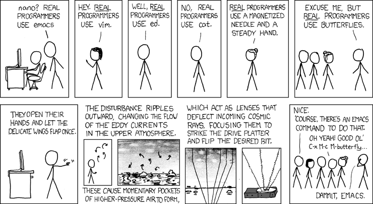

## Willkommen in LF11a!
`Funktionalität in Anwendungen realisieren`

[Quelle: <https://xkcd.com/378/>]{style="font-size: 1.2rem"}

## Willkommen in LF11a!

`Funktionalität in Anwendungen realisieren`

### Themenübersicht

- OOP Grundlagen
- OOP Vertiefung und Design
- Objektorientierte Modellierung und Design; UML
- Schnittstellen, APIs, SQL
- Qualitätssicherung und Tests

## Zeitplan und Noten

- **Klassenarbeit** am 21.10.
- **Klassenarbeit** am 28.10.
- **SOLs** am 9.10. und 23.10.
- **Praxisprojekt** vom 28.10. bis 02.12.
- **Präsentation** des Praxisprojekts am 2. Dezember:  Noten für Mitarbeit und fachliche Leistung
- Am 3. Dezember beginnt **LF12a**

## Themen für Vorträge

- Do., 08.10.: Vererbung, Polymorphie (zu zweit oder zwei Einzelvorträge)
- Mo., 19.10.: UML Sequenzdiagramm, Zustandsdiagramm (zu zweit oder zwei Einzelvorträge)
- Di., 20.10.: Architektur- und Designpatterns: Observer, Singleton, Factory, MVC
- Mi., 21.10. / Do., 22.10.: (nach Klassenarbeit): REST-APIs; JSON; XML

## <!-- -->

{fig-align="center" width="50%"}

::: {style="text-align: center; font-size: 1rem;"}
[©torange.biz](https://torange.biz/cup-coffee-30851) CC-BY 4.0
:::

::: {style="color: green; text-align: center; font-size: 2.8rem"}
**Viel Erfolg!**
:::
