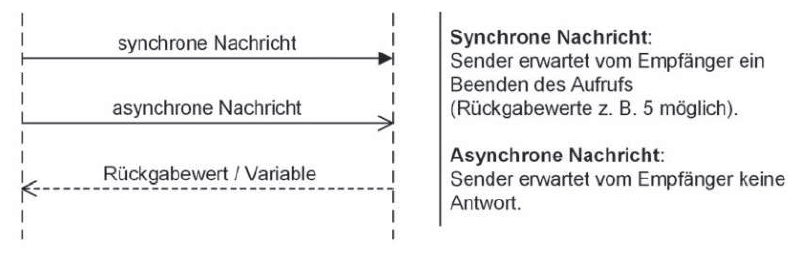
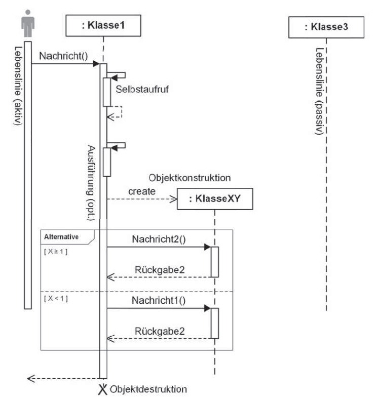
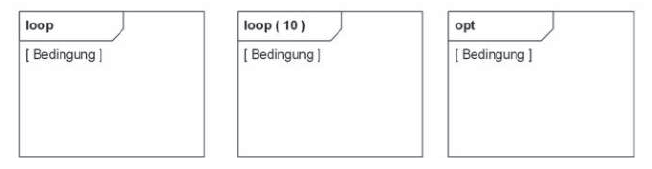
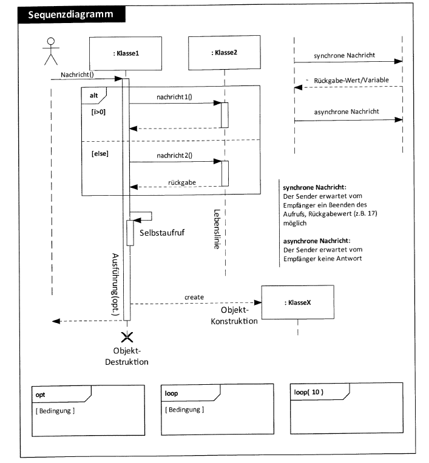

## Sequenzdiagramm: Nachrichten

## <!-- -->

:::: columns
::: {.column width="35%"}

### Sequenz-diagramm: Lebenslinien

:::

::: {.column width="65%"}

:::
::::

## Sequenzdiagramm: Bedingungen

## <!-- -->

:::: columns
::: {.column width="35%"}

### Sequenz-diagramm: Überblick

:::

::: {.column width="65%"}

{fig-align="center" width="100%"}

:::
::::

## Zustandsdiagramme

## <!-- -->

{fig-align="center" width="50%"}

::: {style="text-align: center; font-size: 1rem;"}
[©torange.biz](https://torange.biz/cup-coffee-30851) CC-BY 4.0
:::

::: {style="color: green; text-align: center; font-size: 2.8rem"}
**Viel Erfolg!**
:::
