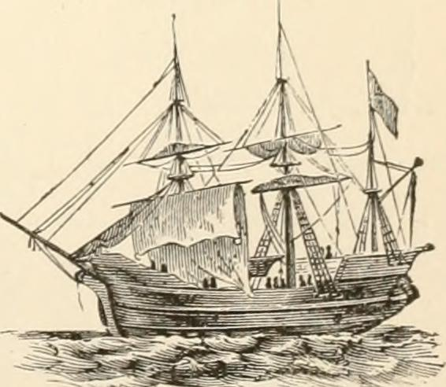

## OOP: Blick in die Geschichte ...

:::: columns
::: column


[[Quelle: Thomas Woodtli, Wikimedia Commons, CC-BY-SA-2.0](https://creativecommons.org/licenses/by-sa/2.0/deed.en)]{style="font-size: 1.4rem"}

:::

::: {.column .incremental style="font-size: 1.7rem"}
- 1960er: **Ole-Johan Dahl** und **Kristen Nygaard** am Norwegian Computing Center in Oslo simulieren Schiffsbewegungen im Osloer Hafen
- Damalige prozedurale Programiersprachen (Algol, Fortran): verfilzter Code; -> **Simula** (OOP)
- 1970er: **Alan Kay** wollte interaktives Computersystem bauen -> Simula -> **Smalltalk** (OOP)
:::
::::


## Geschichte: Schiffe

:::: columns
::: column


[Santa Maria, Schiff von Kolumbus 1492, Wikimedia Commons, vermutlich von Edward H. Hart, public domain]{style="font-size: 1.2rem"}

:::

::: column



[Mayflower, 1620, Wikimedia Commons, CC0 1.0 public domain]{style="font-size: 1.2rem"}

:::
::::


## Geschichte: Schiffe


[RMS Titanic 1912, Francis Godolphin Osbourne Stuart gest. 1923, Wikimedia Commons, public domain]{style="font-size: 1.2rem"}


## Ziele

Grundpfeiler der objektorientierten Programmierung (OOP) verstehen und anwenden können:

- Kapselung, Vererbung, Polymorphie, Interfaces
- Fehlerbehandlung
- UML-Notation
- Zugriffsmodifikatoren
- Pseudocode mit OOP-Konzepten


## OOP: Was ist eine Klasse?

::: {.incremental style="font-size: 2rem"}

- Eine Klasse ist ein **Bauplan für die Erstellung von Objekten.**
- Klasse definiert Attribute und Methoden eines Objekts
  + Attribute: Eigenschaften, Variablen; repräsentieren den **Zustand**
  + Methoden: Funktionen; repräsentieren das **Verhalten**
- Klasse ermöglicht Erstellung **mehrerer Objekte mit ähnlichen Merkmalen und Verhaltensweisen**
:::

::: notes
Lernkarten AP2 2025 Nr. 137
:::


## OOP: Was ist ein Objekt?

::: {.incremental style="font-size: 2rem"}

- eine konkrete Instanz einer Klasse
- besitzt die Attribute und Methoden, die in seiner Klasse definiert sind
- **Jedes Objekt hat seinen eigenen Satz von *Werten* für die Attribute**.
- Attribute -> Zustand des Objekts
- Methoden -> Verhalten des Objekts, das auf diesem Zustand operiert
- **Ein Objekt ist eine Verkapselung von Daten (Zustand) und den dazu gehörenden Operationen (Verhalten).**
:::

::: notes
Lernkarten AP2 2025 Nr. 140
:::


## OOP: Grundideen

- Kapselung *(Encapsulation)*
- Vererbung
- Polymorphie
- Interfaces


## OOP: Kapselung *(Encapsulation)*

::: {.incremental style="font-size: 1.9rem"}

- interne Daten eines Objekts werden vor direktem Zugriff geschützt
- Zugriff erfolgt über definierte Methoden (Getter/Setter)
- Zugriffsmodifikatoren steuern die Sichtbarkeit:  
  *public, private, protected, package*
- schafft **Datenintegrität**: Manipulation nur auf sichere, kontrollierte Weise
- verbessert **Wartbarkeit**: Änderungen an der internen Implementierung der Klasse beeinflussen nicht die Programmteile, die die Klasse verwenden
:::

::: notes
Lernkarten AP2 2025 Nr. 134
:::


## OOP vs. prozedurale Programmierung

:::: {.columns style="font-size: 1.9rem"}
::: {.column width="40%"}

### OOP

- Daten und Funktionen werden zu Objekten **zusammengefasst**
- Objekt kann Attribute (Daten) und Methoden (Funktionen) enthalten

:::

::: {.column width="60%"}

### Prozedurale Programmierung

::: fragment

- Programm führt eine Reihe von Aufgaben aus: **Prozeduren**
- Prozeduren operieren auf **Daten**
- Daten sind **getrennt** von Prozeduren; Prozeduren **bearbeiten** die Daten

:::
:::
::::

::: notes
Lernkarten AP2 2025 Nr. 136
:::


## Prozedur vs. Funktion

:::: {.columns style="font-size: 1.9rem"}
::: {.column width="45%"}

### Funktion

- Codeblock, der eine spezifische Aufgabe ausführt
- **liefert in der Regel einen Wert zurück**

:::

::: {.column width="55%"}

### Prozedur

::: fragment

- Codeblock, der eine spezifische Aufgabe ausführt
- **liefert in der Regel *keinen* Wert zurück**
- Prozedur führt Aufgabe aus und kehrt dann zur aufrufenden Stelle im Code zurück

:::
:::
::::

::: notes
Lernkarten AP2 2025 Nr. 135
:::


## OOP: Kapselung - Zugriffsmodifikatoren

::::: {style="font-size: 1.8rem"}
Zugriffsmodifikatoren bestimmen, wo auf Klassen, Methoden und Variablen zugegriffen werden kann.

:::: columns
::: {.column width="40%"}

Zugriffs-<br>modifikator | Symbol |
--------------------|----------|
`public` <br> &nbsp; | + |
`private` <br> &nbsp; | - |
`protected` <br> &nbsp; | # |
`package` | ~ |
:::

::: {.column .fragment width="60%"}

| Bedeutung <br> &nbsp; |
|-----------|
| Zugriff **überall** erlaubt, sowohl innerhalb als auch außerhalb der Klasse
| Zugriff **nur innerhalb der Klasse** erlaubt, in der sie definiert sind
| Zugriff nur innerhalb der Klasse, des Pakets und von abgeleiteten Klassen erlaubt
| Zugriff ist innerhalb der Klasse und in allen Klassen desselben Pakets erlaubt
:::
::::
:::::

::: notes
Lernkarte AP2 2025 Nr. 142
:::


## OOP: Kapselung - Zugriffsmodifikatoren

::::: {style="font-size: 1.8rem"}

#### IHK-Standard in Prüfungen

Zugriffs-<br>modifikator | Symbol | Bedeutung | Verwendung
:-----|:---:|:-----------|:---
`private` | - | Zugriff **nur innerhalb der Klasse** erlaubt, in der sie definiert sind | Attribute
`public` | + | Zugriff **überall** erlaubt, sowohl innerhalb als auch außerhalb der Klasse | Operation / Methode

#### UML-Beispiel

:::: columns
::: {.column .fragment width="40%"}

```
+------------------------------+
|          Konto               |
|------------------------------|
| - kontostand: double         |
|------------------------------|
| + getKontostand(): double    |
| + einzahlen(betrag: double)  |
| + abheben(betrag: double)    |
+------------------------------+
```

:::

::: {.column .fragment width="60%"}

- Niemand darf direkt auf den Kontostand (`private`) zugreifen und ihn verändern
- Veränderung nur über die `public`-Methoden `einzahlen()` und `abheben()`, die eine **Validierung** durchführen

:::
::::
:::::


## Kapselung: Pseudocode

::: {style="font-size: 1.6rem"}

```pseudo
KLASSE Konto
    PRIVAT kontostand: Zahl

    OEFFENTLICH METHODE getKontostand(): Zahl
        RUECKGABE kontostand
    ENDE METHODE

    OEFFENTLICH METHODE einzahlen(betrag: Zahl)
        WENN betrag > 0 DANN
            kontostand = kontostand + betrag
        SONST
            ausgabe("Ungültiger Betrag!")
        ENDE WENN
    ENDE METHODE

    OEFFENTLICH METHODE abheben(betrag: Zahl): Wahrheitswert
        WENN betrag > 0 UND betrag <= kontostand DANN
            kontostand = kontostand - betrag
            RUECKGABE WAHR
        SONST
            ausgabe("Nicht genuegend Guthaben!")
            RUECKGABE FALSCH
        ENDE WENN
    ENDE METHODE
ENDE KLASSE
```

:::


## Vererbung: UML

::: {style="font-size: 2rem"}

Eine Klasse (Kindklasse / Unterklasse) kann Attribute und Methoden einer anderen Klasse (Elternklasse / Oberklasse) übernehmen und erweitern.

:::

::: {style="font-size: 1.8rem"}

```
+----------------------------+
|       Fahrzeug             |
|----------------------------|
| # marke: String            |
| # baujahr: int             |
|----------------------------|
| + beschreibung(): String   |
+----------------------------+
         ^            ^
         |            |
    erbt von      erbt von
         |            |
+------------------+  +--------------------+
|     PKW          |  |       LKW          |
|------------------|  |--------------------|
| - anzahlSitze    |  | - ladekapazitaet   |
|------------------|  |--------------------|
| + beschreibung() |  | + beschreibung()   |
+------------------+  +--------------------+

```
:::


## Vererbung: Pseudocode

::::: {style="font-size: 1.7rem"}

```pseudo
KLASSE Fahrzeug                         // Elternklasse
    GESCHUETZT marke: String
    GESCHUETZT baujahr: Zahl

    METHODE beschreibung(): String
        RUECKGABE marke + " (" + baujahr + ")"
    ENDE METHODE
ENDE KLASSE
```

<br>

:::: columns
::: {.column .fragment}

```pseudo
KLASSE PKW ERBT VON Fahrzeug        // Kindklasse
    PRIVAT anzahlSitze: Zahl

    METHODE beschreibung(): String  // überschrieben
        RUECKGABE marke + " (" + baujahr + "), 
        " + anzahlSitze + " Sitze"
    ENDE METHODE
ENDE KLASSE
```

:::

::: {.column .fragment}

```pseudo
KLASSE LKW ERBT VON Fahrzeug        // Kindklasse
    PRIVAT ladekapazitaet: Zahl     // in Tonnen

    METHODE beschreibung(): String  // überschrieben
        RUECKGABE marke + " (" + baujahr + "), 
        " + ladekapazitaet + " t"
    ENDE METHODE
ENDE KLASSE
```

:::
::::
:::::


## Vererbung: Begriffe

- **Oberklasse (Superklasse)** – Klasse, von der geerbt wird
- **Unterklasse (Subklasse)** – Klasse, die erbt
- **super** – Zugriff auf Methoden/Konstruktor der Oberklasse
- **Ist-ein-Beziehung** – PKW ist ein Fahrzeug (Vererbung)
- **Hat-ein-Beziehung** – Fahrzeug hat einen Motor (Komposition, keine Vererbung)

- Durch Vererbung müssen gemeinsame Attribute (marke, baujahr) und Methoden nur einmal in der Elternklasse definiert werden.
- Kindklassen fügen spezifische Attribute hinzu und können Methoden überschreiben.


## Polymorphie: Pseudocode

#### Überschreiben (Overriding)

```
KLASSE Tier
    METHODE sprechen(): String
        RUECKGABE "..."
    ENDE METHODE
ENDE KLASSE
```

:::: columns
::: column

```
KLASSE Hund ERBT VON Tier
    METHODE sprechen(): String       // ueberschreibt Tier.sprechen()
        RUECKGABE "Wau!"
    ENDE METHODE
ENDE KLASSE
```

:::

::: column

```
KLASSE Katze ERBT VON Tier
    METHODE sprechen(): String       // ueberschreibt Tier.sprechen()
        RUECKGABE "Miau!"
    ENDE METHODE
ENDE KLASSE
```

:::
::::

## Polymorphie: Beispiel

```
// tiere: Liste von Tier = [neuer Hund(), neue Katze()]
FUER JEDES t IN tiere
    ausgabe(t.sprechen())            // "Wau!", "Miau!"
ENDE FUER
```


## Polymorphie: Pseudocode

#### Überladen (Overloading)

```
KLASSE Rechner
    METHODE addiere(a: Zahl, b: Zahl): Zahl
        RUECKGABE a + b
    ENDE METHODE

    METHODE addiere(a: Zahl, b: Zahl, c: Zahl): Zahl   // überladene Methode
        RUECKGABE a + b + c
    ENDE METHODE
ENDE KLASSE
```


## Schnittstellen *(Interfaces)*

**Definition:** Ein Interface (Schnittstelle) definiert eine Menge von Methodensignaturen, die eine implementierende Klasse umsetzen MUSS. Ein Interface enthält keinen eigenen Code (keine Implementierung).

**Pseudocode:**

```pseudo
INTERFACE Druckbar
    METHODE drucke(): nichts
ENDE INTERFACE
```

:::: columns
::: column

```pseudo
KLASSE Rechnung IMPLEMENTIERT Druckbar
    ATTRIBUT betrag: Zahl

    METHODE drucke()
        ausgabe("Rechnung: " + betrag + " EUR")
    ENDE METHODE
ENDE KLASSE
```

:::

::: column

```pseudo
KLASSE Lieferschein IMPLEMENTIERT Druckbar
    ATTRIBUT artikelListe: Liste

    METHODE drucke()
        ausgabe("Lieferschein mit " + laenge(artikelListe) + " Artikeln")
    ENDE METHODE
ENDE KLASSE
```

:::
::::


## Interface vs. abstrakte Klasse

| Kriterium | Interface | Abstrakte Klasse |
|-----------|-----------|-----------------|
| Implementierung | Keine (nur Signaturen) | Kann Methoden mit Code enthalten |
| Mehrfachvererbung | Ja (Klasse kann mehrere Interfaces implementieren) | Nein (nur eine Elternklasse) |
| Attribute | Keine (nur Konstanten) | Ja |
| Konstruktor | Nein | Ja |
| Einsatz | Vertrag/Schnittstelle definieren | Gemeinsame Basis mit Teilimplementierung |


## Interface vs. abstrakte Klasse: UML

```
+-------------------+       +-------------------+
| <<interface>>     |       | <<abstract>>      |
| Druckbar          |       | Dokument          |
|-------------------|       |-------------------|
|                   |       | # titel: String   |
|-------------------|       |-------------------|
| + drucke(): void  |       | + drucke(): void  |  (abstrakt)
+-------------------+       | + speichere()     |  (implementiert)
        ^                   +-------------------+
        |                            ^
  implementiert                   erbt von
        |                            |
+-------------------+       +-------------------+
| Rechnung          |       | Rechnung          |
|-------------------|       |-------------------|
| + drucke(): void  |       | + drucke(): void  |
+-------------------+       +-------------------+
```


## <!-- -->

{fig-align="center" width="50%"}

::: {style="color: green; text-align: center; font-size: 2.8rem"}
**Viel Erfolg!**
:::
